# Eatical Web App
## Maribor Digital Twin

This project was created as a part of a subject at [R-IT-FERI](https://feri.um.si/en/study/programmes/first-cycle/un/rit/). Check Wiki pages for more info.

## Idea

The idea for our project is for restaurants to publish meals on our app that otherwise would be of a bigger price (the original price), but since the meal is something that they've prepared before and they are unable to sell it, they are selling it via our app for a cheaper price. The restaurants can register via our [Desktop App](https://github.com/makedonkabinova/eatical-desktop), while users (customers) can register via our web app. Lets look from both sides:

### Restaurant

#### Homepage

Homepage of restaurant has different topbar.

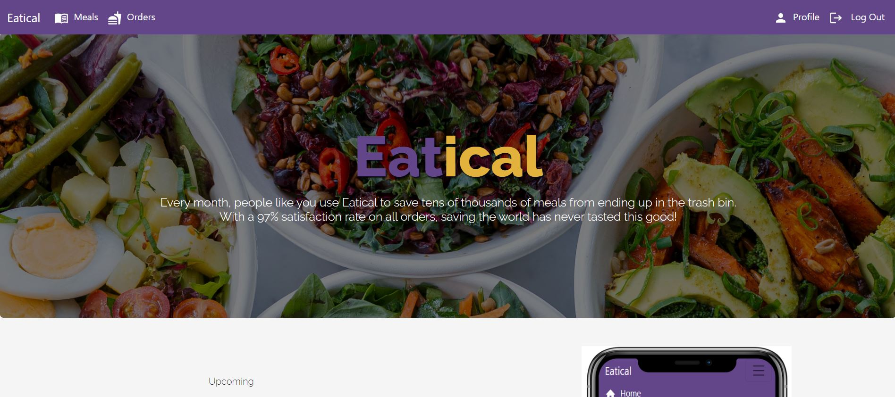

#### Meals

When we click on meals option we see the meals for the restaurant, but that doesn't mean that they are available to order yet from our customers, unless the restaurant wants to publish them as available. Currently there are none so we can add some.

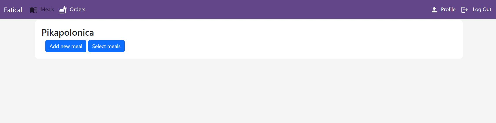
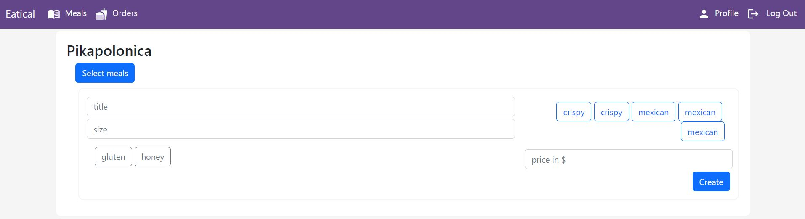
When we add the meal, we have the option to select it, add pick up date and order by date and publish it.

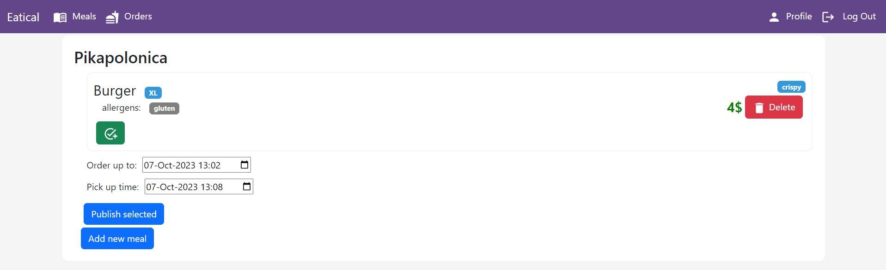

#### Orders

Under orders we can see active orders and completed. Active means we have the order not picked up or not ordered yet, so it is shown to customers.

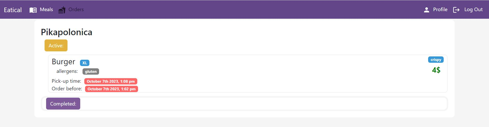

#### Profile
Basic profile view for the restaurant:

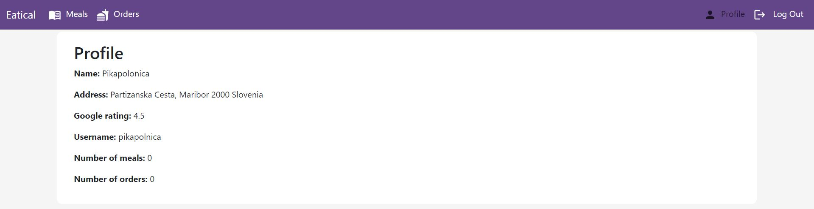

### User (Customer)

#### Homepage

Homepage of customer has different topbar

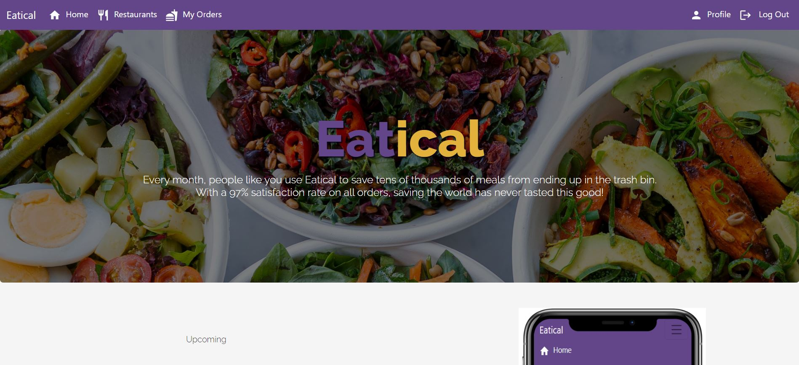

#### Register

Unlike restaurants, which can register via our [Desktop App](https://github.com/makedonkabinova/eatical-desktop), the customers can register via our web app:
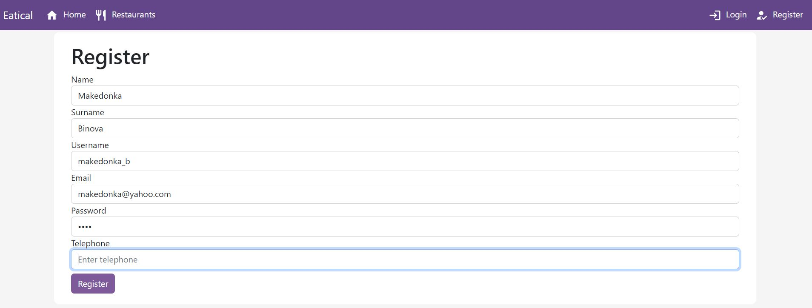

#### Login

Then login is available for customers and restaurants as well.
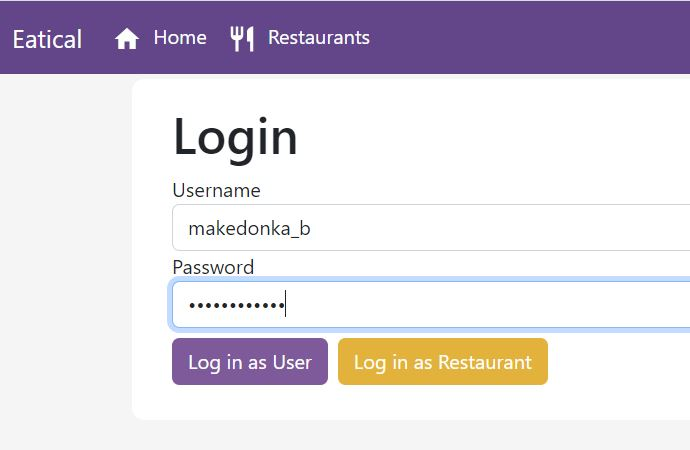

#### Map of Restaurants

Under restaurants, we can see the restaurants on the map, also how many meals they have available for customers to order them.

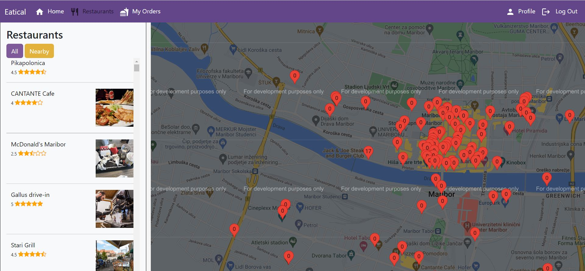

The customer can select one restaurant that he/she wants to make an order from. Then the customer can see the restaurant up close on the map and info about it in a card. When the customer clicks order it redirects as to order page.

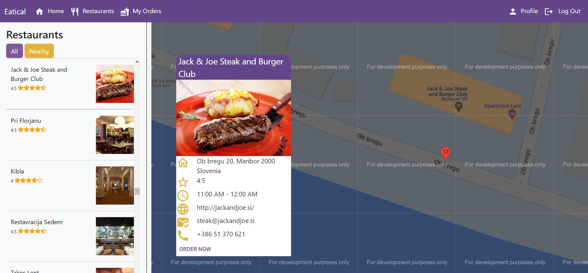

#### Order from restaurant's menu

We can click on the shopping card and order it.

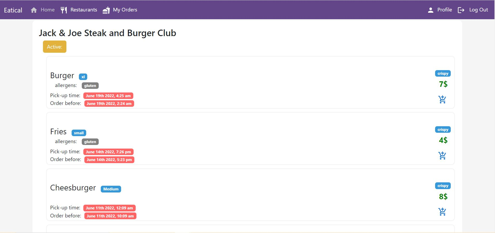

#### My Orders view

The customer can take a look on its orders.

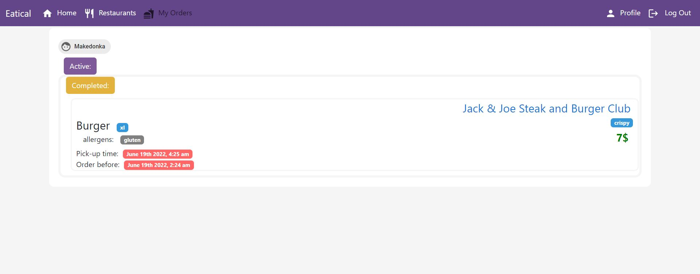

#### User Profile

Basic look into the customer's profile:

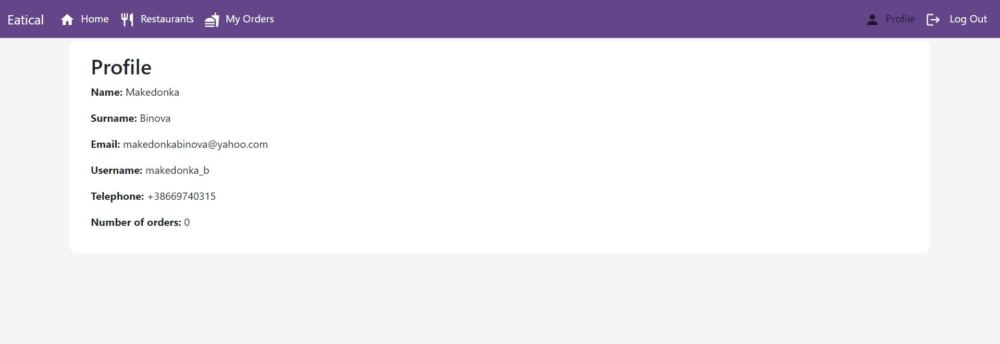
